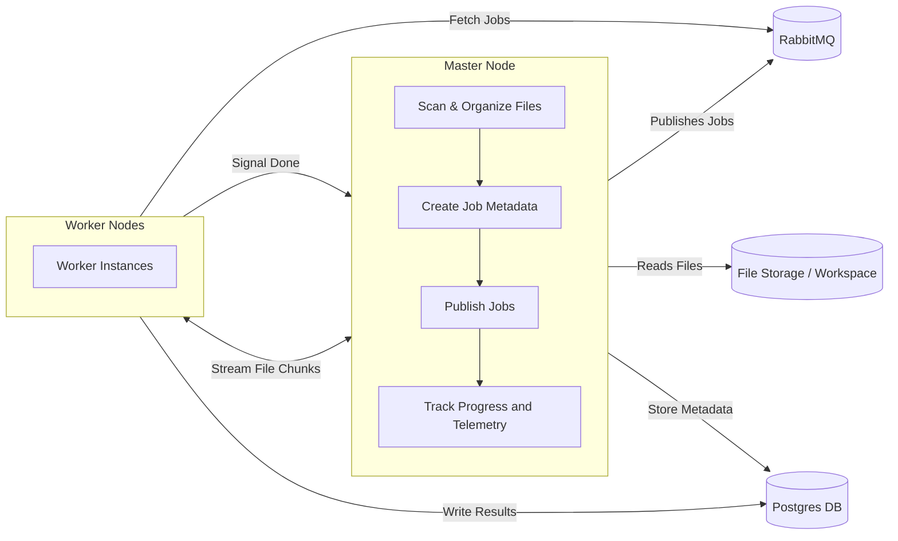
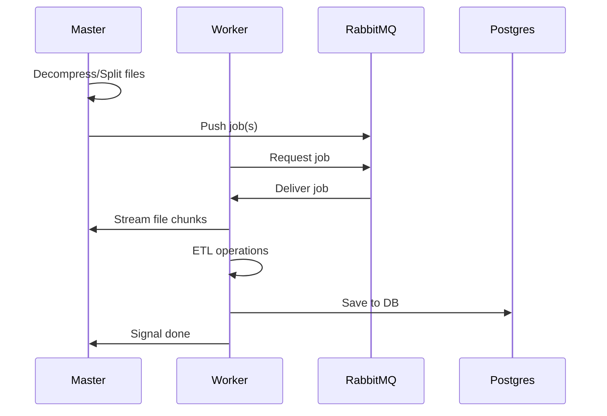

## What is Protheon?

[Protheon](https://www.github.com/deahtstroke/protheon) grew out of work I
had started on a larger system, [RivenBot](https://www.github.com/Riven-of-a-Thousand-Servers),
which relied on a sizeable dataset that needed heavy preprocessing. The original
project stalled, partly because the game's state made it hard to stay motivated,
but the technical challenges around dataset processing stuck with me. Instead putting
everything on the back burner, I turned that specific problem into a focused learning
project on distributed systems. This project is the result of that
shift in scope: a chance to learn by building something real, even if the
original application is on pause.

The immediate challenge was simple: I needed a way to process a large dataset
quickly without babysitting long-running jobs or pushing everything through one
overloaded machine. I had already solved this problem once as part of the original
[Java-based project](https://www.github.com/deahtstroke/pgcr-batch-processor),
but it was slow and never really designed with distributed work in mind. It got
the job done, but it wasn't something I could scale or build upon meaningfully.
Rewriting it gave me a chance to rethink the design more
deliberately and use it as a hands-on introduction to distributed systems.

This article outlines the overall design of the system, why it's structured
the way it is, and the trade-offs behind each decision. I'll walk through
the architecture, how tasks move through the pipeline, how the master and
worker nodes communicate, and what I learned while turning a simple
batch processor into a distributed one.

## Architectural Overview

Before looking at the inner workings of the system, it helps to understand
the overall structure and how the major components interact. Protheon was
designed as a master-worker distributed system, where the master node
orchestrates jobs, and worker nodes handle processing tasks concurrently.

The high-level flow is straightforward:

1. **Master Node**: Responsible for organizing work, managing and streaming
file chunks, and relaying job telemetry.
2. **Worker Node**: Performs the actual processing of file chunks, including
transforming and storing data (ETL).
3. **Work Queue (RabbitMQ)**: Handles job distribution, ensures reliable
delivery, and decouples the producer from worker nodes.
4. **Database (PostgreSQL)**: Stores the processed data.

Below is a diagram showing how these different components interact with
each other.



## Job Lifecycle

A single job represents a segment of one `.jsonl.zstd` file.
These files are zstd-compressed JSON-lines blobs; once decompressed,
each line is an independent JSON object that can be processed in isolation.
The master node splits the decompressed file into logical segments
and publishes a job definition for each file chunk to RabbitMQ,
making them available for workers to claim.

The lifecycle below shows how one job moves through the system from the
moment the master node publishes it, to the worker pulling it,
streaming the required file chunks, processing them, and committing results to Postgres.



## The Master Node

The master node is the coordinator of the system, the part that actually makes
distributed work possible. It’s responsible for:

- Defining clear `gRPC` methods for streaming file chunks to worker nodes and
file cleanups.
- Managing the **workspace** for the current file that's being processed
(opening/closing files, and queueing tasks in the work queue).
- Relay telemetry data about the current state of the system (files completed,
throughput stats, etc).

An indirect but obvious requirement is that **the host with the better hardware
profile should act as the master node**. It handles most of the I/O operations
and while I/O is influenced by computer power, network latency, and storage speed,
giving this role to the beefiest machine still yields better throughput for a
small distributed setup like this.

### GRPC vs. HTTP

Another major decision that I made with the Master Node was the use of [gRPC](https://grpc.io/)
instead of HTTP-based streaming for relaying file chunks to worker. This
was made because of several limitations that are intrinsic to TCP-based protocols:

1. **Message Framing**: In TCP, and transitively HTTP, there are no clear bounds
on messages, its just a continous stream of bytes that is relayed
to the listener/client. gRPC does not have this limitation, it has clear message
bounds and schema through the use of [Protobuf](https://protobuf.dev/).
2. **Controlled Environment**: Generally speaking, gRPC is favored over HTTP
when all communication happens in a controlled environment and there's
no need to expose public-facing endpoints. This makes node-to-node
communication simpler.
3. **Binary Efficiency**: Streaming Protobuf’s binary format
is generally faster than streaming JSON
over HTTP. This shouldn't surprise anyone: Binary payloads tend to be
leaner and quicker to parse than JSON. It's also more conveninent
for me: If ever I need JSON, I can just generate it from the
Protobuf schema using Go's `protojson` package.

### The Workspace?

Earlier I wrote that the master node manages a "workspace". I'm simply talking
about a directory on disk. Nothing fancier than a build directory in a
build tool such as Gradle, Node, or SvelteKit. However, this workspace
instead of containing compiled files has file chunks, more specifically,
two-hundred files each containing fifty-thousand lines
due to each compressed file having static ten million lines to process. The Master
Node handles organizing and cleaning them up whenever a worker request or finish
tasks.

## The Worker Node(s)

The worker nodes were designed to be lightweight in responsibility,
only doing specific tasks in an idempotent way. In this case, ingest some bytes
from a source, transform them, and subsequently save them to a SQL database, nothing
fancy. However, they still need to have to communicate with third-party services,
namely, the database, the work queue, and the `gRPC` server. Another important
consideration is being able to use PostgreSQL's [pipeline mode](https://www.postgresql.org/docs/current/libpq-pipeline-mode.html)
for better utilization of the network while performing round trips, which is
why I decided to use the [`pgx`](https://github.com/jackc/pgx)
Go database drivers due to their focused support for this feature.

The worker node's work loop is very simple:

- Fetch a job from the RabbitMQ work queue.
- Request a stream of file chunks via their built-in gRPC client.
- Run ETL logic to the PostgreSQL database.

Additionally, since the worker node process runs in different hosts
and the program itself is packaged as a CLI application, I made a `flag`
option to let me pick the number of goroutines to use for a given worker.
This let's me scale concurrency horizontally with the number of worker nodes.
Below is a pseudo-working example of the `main.go` program for the worker
nodes, displaying the use of flags for configuration:

``` go
package main

// ... imports and boring stuff here

var (
    rabbitUrl  = flag.String("rmq", "", "RabbitMQ connection URL")
    grpcUrl    = flag.String("grpc", "", "gRPC server URL")
    pgUrl      = flag.String("pg", "", "PostgreSQL connection url")
    numWorkers = flag.Int("n", 1, "Number of workers to spin up")
)

func main() {
    flag.Parse()

    ctx, stop := signal.NotifyContext(context.Background(), syscall.SIGINT, syscall.SIGTERM)
    defer stop()

    // ...
    // dependency injection and boring stuff ... 
    // ...

    consumer := consumer.NewPgcrTaskConsumer(*tui, client, rabbitSubscriber, processingService)
    for i := range *numWorkers {
	go func() {
	    if err := consumer.Consume(ctx); err != nil {
		log.Fatal(err)
	    }
	}()
    }

    <-ctx.Done()
    log.Printf("Shutting down worker gracefully")
}
```

## The Worker Queue (RabbitMQ)

RabbitMQ is a solid fit here because it naturally does two jobs at once:
job dispatch and load balancing. There's no need to create a separate load-balancer
layer because its queueing model already distributes work based on which worker is
ready. It also benefits from having back-pressure mechanisms and an ACK/NACK system
that's inspired by TCP's own ACK system. Using RabbitMQ is a better option than
rolling out an entire coordination logic system. The cost of using it is maintenance
and configuration, which the benefits already outweigh.

One important note is that RabbitMQ will happily let a single worker drain
the entire queue unless you configure it properly. **Always set QoS/prefetch limits**
so workers only receive a predefined amount of jobs when they have capacity. Without
this workers will get lopsided load distribution (as mine did early on). Here's
the configuration I use to enforce a strict one-at-a-time delivery:

``` go
    q, err := ch.QueueDeclare(queueName, true, false, false, false, nil)
    if err != nil {
	    ch.Close()
	    conn.Close()
	    return nil, err
    }

    host, _ := os.Hostname()

    // Prefetch count=1 (one unacked message at a time), size=0, global=false
    err = ch.Qos(1, 0, false) 
    if err != nil {
	    return nil, err
    }

    delivery, err := ch.Consume(q.Name, host, false, false, false, false, nil)
    if err != nil {
	    ch.Close()
	    conn.Close()
	    return nil, err
    }
```

## Storage/Database

For storage, the setup is intentionally modest: a single SSD that comfortably
holds the entire dataset. Keeping everything on one drive simplifies
the design but also anchors the master node to whichever machine physically
hosts that disk. I could shard or replicate the data across nodes,
but the extra coordination isn’t worth it for this project’s scope.
On the database side, Postgres is simply the most practical choice
for me. I get reliability, strong tooling, and first-class support
in Go through [pgx](https://github.com/jackc/pgx), which takes
full advantage of the Postgres wire
protocol, especially for fast, batched inserts. Below you can see the
simplicity of using batched inserts in pgx:

``` go
func (r *BatchRepository) SendBatch(ctx context.Context, batch *pgx.Batch) error {
    tx, err := r.DB.Pool.Begin(ctx)
    if err != nil {
	    return err
    }

    defer tx.Rollback(ctx)

    results := tx.SendBatch(ctx, batch)
    if err := results.Close(); err != nil {
	    return fmt.Errorf("Send batch error: %v", err)
    }

    return tx.Commit(ctx)
}
```

The combination of Postgres and a simple SSD keeps the system straightforward
without sacrificing performance where it actually matters.

## Limitations and Potential Improvements

Since the project is still in the building-phase there is a lot of
improvements to be done in several areas. Here's just a list of features
and/or limitations by system component:

### Master Node

Since the master is responsible for both coordinating work and hosting
the storage, losing it halts scheduling and access to the dataset entirely.
Most of its limitations revolve around this issue:

- If the master node fails then the whole system fails, which points to a
**single point of failure**. Several distributed systems deal with this issue by
appointing a new master node on-the-go if the current one fails, so this
could be a solution to this problem.
- Setting up the workspace has some expensive operations such as decompressing
the current `zstd` file, splitting it up into chunks, and then compressing the
chunks. This is expensive both in runtime and space complexity, meaning that this
workspace step is a big pain-point given the data constraints.
- Currently, in the scenario where the amount of file chunks left to process
is less than the number of workers, several workers would sit idle waiting for
the file to be completed entirely.
- The master node is also bound to the machine that has the physical
SSD which adds to the single point of failure problem above.
- One master node means that the throughput of the system (organizing,
streaming files, and telemetry) is capped at a single machine's CPU/network
capacity.
- Telemetry itself has not been implemented yet. The plan is to use a combination
of Grafana and Prometheus to scrape logs from the individual workers.
- Worker healthchecks were temporarily implemented using HTTP requests,
however since moving over to gRPC, healthchecks have been removed for now.

### Worker Node(s)

One could call out that the worker nodes do not have access to the overall
global system, however this "limitation" is intentional, however there are
several other issues to call out for the workers:

- Worker configuration can be tricky to deduce since different machines have
different hardware profiles. This means that the optimal number of Goroutines
can differ between machines. As of now, the current packaged binary does not
calculate or identify a reasonable concurrency configuration for each worker
out of the box.
- As part of the telemetry section, several data has to be collected from
each worker node such as throughput, healthchecks, processing stats, etc.
This has yet to be implemented as well.
- There's no draining mechanism during graceful shutdown, if a worker node
goes down, any in-flight jobs are not finished before exiting.

### Overall System

The way that the binaries are packaged and distributed is clunky. I explained
in the [worker node(s)](/blog/protheon#the-worker-nodes) section that the
master and worker artifacts are plain CLI applications that
are compiled for different OSs and CPU architectures.
The more diverse the hardware profiles and architectures of the workers, the more
binaries that need to be compiled, and as code changes and more dependencies are
added, the longer it takes to create binaries for all OSs and Architectures.
This could be simplified by utilizing containerization for ease of
distribution and solve this multi OS/arch pain point. Pairing
this with container orchestrators such as Docker Swarm or Kubernetes could
offload a lot of the coordination to them instead of the programs
themselves, however this would be adding more complexity into the mix.

## Conclusion

Working on Protheon has been both fun and painful. Building something
that has to coordinate with other machines in real time forced me to think
differently, break things, fix them, and break them again. I skipped a lot of
the "best practices" I normally obsess over: tests, clean abstractions, slow
careful planning, and instead pushed code, watched it fail, and learn from
the wreckage. This speed helped me early on, but eventually the lack of
structure started biting back. For example, skipping unit tests early on
meant I didn't catch dumb bugs in my error handling,
such as `if err == nil { ... }`. That little line cost me perhaps two hours of
precious time, which is why I've shifted toward testing and tidying things up now.

Distributed systems have their own brand of complexity: unpredictable behavior,
hidden bottlenecks, coordination hassles, and the constant reminder that everything
fails eventually, but they also force you to think differently. You don't
get that without patience, pain, and a lot of hard-earned clarity and Protheon
gave me (and is giving me) all of that.

If you want to experiment with Protheon or see how the architecture works in practice,
checkout the [Github Repository](https://www.github.com/deahtstroke/protheon).
